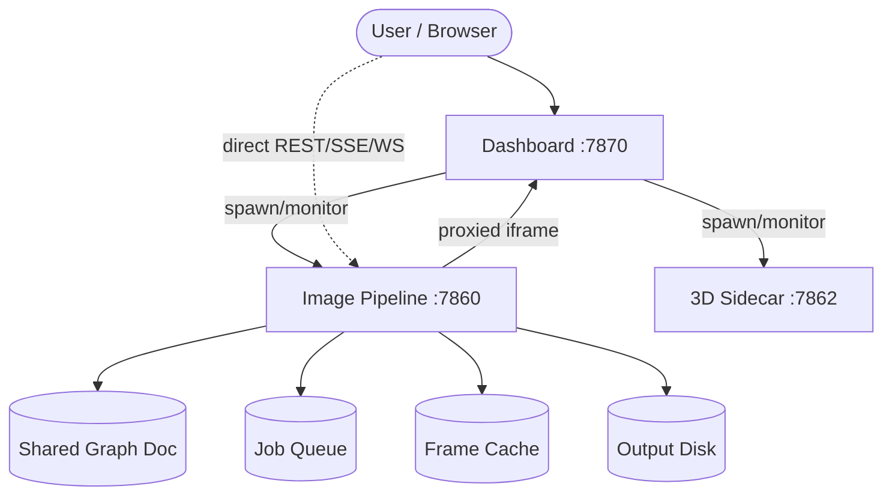

# Architecture

Grillmaster Command Center is a local-first generative art studio. The Image Pipeline FastAPI server (`:7860`) is supervised by a Dashboard process (`:7870`) that spawns it as a child and proxies its status. The browser UI (`ui/index.html`) talks directly to the Image Pipeline server over REST, Server-Sent Events, and WebSocket. A Node.js three.js sidecar on `:7862` serves the 3D viewport; the pipeline server boots it on demand the first time a graph contains 3D nodes.

Data enters the Image Pipeline either as a single method invocation (CLI or UI "Generate") or as a node graph (UI "Node Graph" tab). In both paths the request reaches `server.py`, which looks up the method in the registry, builds a `GraphExecutor` from the graph topology, and runs a topological sort. Architecture-A simulation methods cook an entire frame list internally and are cached by the executor; Architecture-B methods are stateless single-frame generators driven by a timeline. Output is written to disk as PNG/JPEG and streamed back to the UI via SSE or MJPEG.

## Components

- **Image Pipeline Server** — FastAPI app in `image_pipeline/server.py`. Entry point for all REST/SSE/WebSocket traffic. Manages the job queue, live-sim loop, graph document store, asset uploads, Node Doctor, and Node Tester. See [`server.md`](modules/server.md).
- **Graph Executor** — `image_pipeline/core/graph.py`. Topological sort, per-node dispatch, cache-aware invalidation, Architecture-A/B split. See [`core-graph.md`](modules/core-graph.md).
- **Method Registry** — `image_pipeline/core/registry.py`. Decorator-based auto-discovery; `MethodMeta` holds id, name, category, params, ports, and tags. See [`core-registry.md`](modules/core-registry.md).
- **Method Library** — 373 generators across `image_pipeline/methods/` (8 categories + top-level files). Each file is self-contained and registers on import. See [`methods-library.md`](modules/methods-library.md).
- **Post-Process / Annotator** — `image_pipeline/core/postprocess.py` (~56 OpenCV effects) and `core/annotator.py` (demo overlay). See [`core-postprocess.md`](modules/core-postprocess.md), [`core-annotator.md`](modules/core-annotator.md).
- **Dashboard** — `dashboard/__init__.py`. Optional process supervisor: spawns the Image Pipeline and the 3D sidecar as subprocesses and reports their health. Not load-bearing — the pipeline server manages the sidecar itself. See [`dashboard.md`](modules/dashboard.md).
- **UI Editor** — `ui/index.html` + `ui/js/`. Tabbed SPA: Methods tab, Node Graph tab (graph canvas + 3D viewport docked side-by-side), Diagnostics tab. Pure ES modules, vendored three.js r185, no build step. See [`ui-editor.md`](modules/ui-editor.md).

## System Diagram

## Data Flow

1. **Request arrives** — `server.py` route handler (`/api/generate`, `/api/graph/execute`, `/api/graph/live`) receives the request.
2. **Method / graph resolution** — Single-method requests resolve via `registry.get_meta()`. Graph requests load the shared graph document and build a `GraphExecutor` from nodes/edges.
3. **Topological execution** — `GraphExecutor.execute()` topologically sorts the graph, dispatches each node to its registered method, and passes image/field/mask data along typed edges.
4. **Cache check** — Before cooking, the executor checks the frame cache (by node-id + param hash + frame). Architecture-A sims cache their full frame list; Architecture-B results are per-frame.
5. **Method cooking** — The method function writes output images to the job's `out_dir` (or returns an ndarray / dict). Architecture-A methods call `capture_frame()` per frame.
6. **Post-process** — If a `--filter` spec is present, `postprocess.apply_filter()` runs the named OpenCV effect.
7. **Stream back** — The job queue is drained into an SSE stream (`/api/jobs/{id}/stream`) or MJPEG frames (`/api/graph/live/stream`). The UI renders the result.
8. **Live loop** — For `/api/graph/live`, a background thread re-reads the shared graph doc every frame, re-uses the same `GraphExecutor`, and selectively invalidates only nodes whose non-volatile params changed.

## Key Design Decisions

- **Shared graph document as source of truth.** The live loop reads the graph doc every frame rather than capturing a snapshot at start time. This means an edited graph is absorbed by the running loop without restarting — a param tweak never spawns a second render.
- **Selective cache invalidation.** `GraphExecutor.selective_invalidate()` compares old and new node/edge sets and only flushes cache entries for nodes that actually changed, preserving Architecture-A sim caches across unrelated edits.
- **Lazy imports for heavy deps.** OpenCV (`cv2`), matplotlib, torch, and moderngl are imported inside the method that uses them. The server and every other method run fine without them installed.
- **Process-group kill.** The Dashboard kills services with `os.killpg(os.getpgid(pid), signal.SIGTERM)` so any children the service spawned die too — prevents orphaned listeners after a stop.
- **Health-check over socket check.** `_is_healthy()` requires a 200 from `/health`, not just a LISTEN socket. A wedged server keeps its socket open but answers nothing.
- **No build step for the UI.** The front-end is plain ES modules loaded via import map. three.js is vendored as a single `.module.js` file so it works from `file://` or any static server without bundling.
