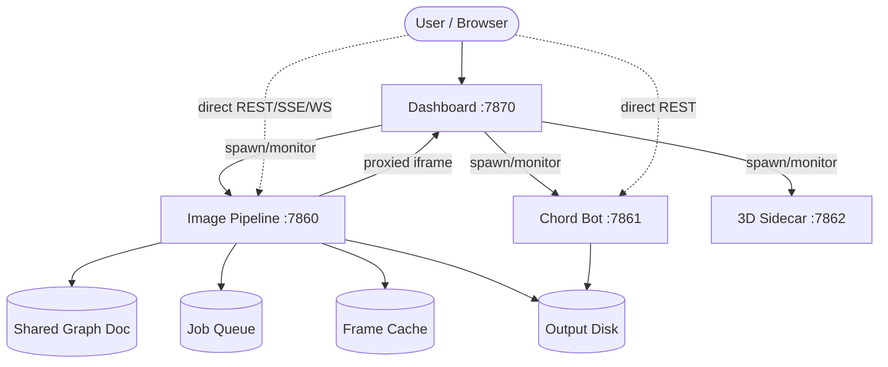

# Architecture Diagram

This is the system-level flowchart for Grillmaster Command Center. The prose version with component descriptions and data-flow steps lives in [`../architecture.md`](../architecture.md).

## Notes

- **Solid arrows** are process supervision (Dashboard spawns and monitors the services). **Dotted arrows** are direct client→server traffic — the browser talks straight to the Image Pipeline and Chord Bot, not through the Dashboard.
- The **Shared Graph Doc** is the single source of truth for the live simulation loop: the running loop re-reads it every frame, so an edited graph is absorbed without restarting.
- The **Frame Cache** is keyed by node-id + parameter hash + frame; Architecture-A simulation methods cache their full frame list here.
