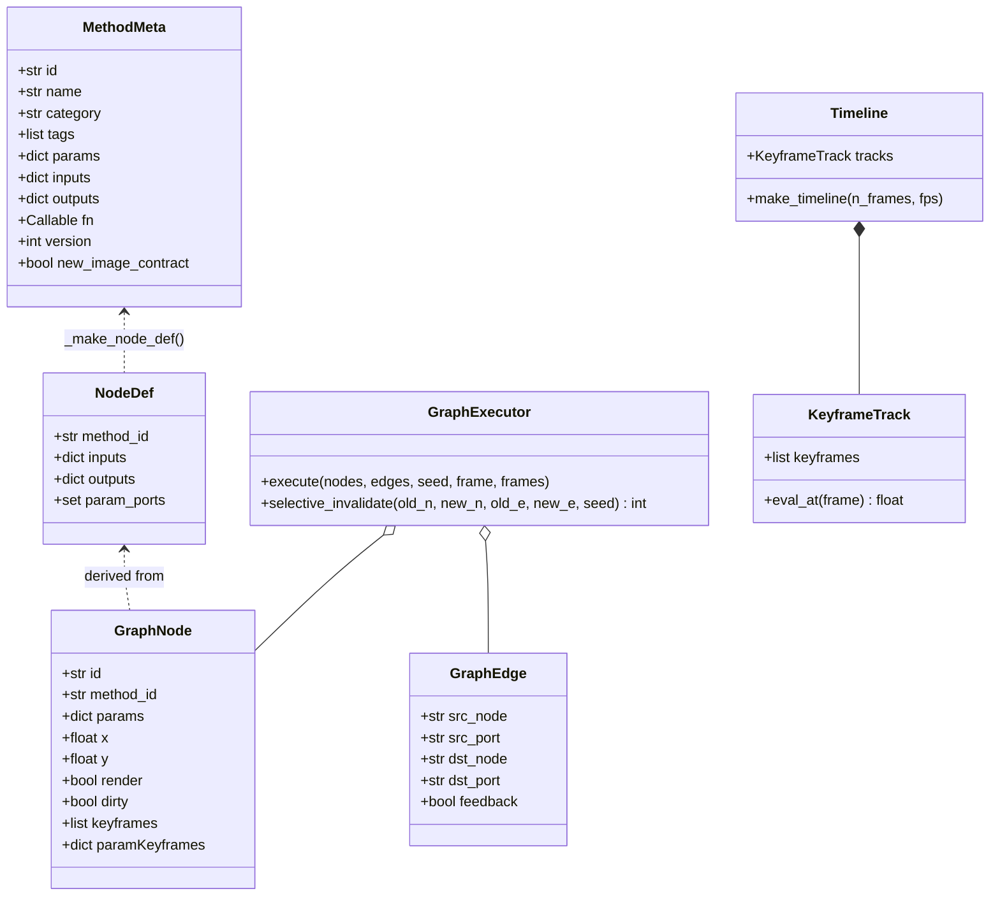

# Class Diagram

The Image Pipeline uses a decorator-registry + executor pattern. The classes below are the load-bearing types — every field shown was observed in the source reads (registry.py, graph.py, timeline.py).

## Notes

- **`NodeDef` is auto-generated** from `MethodMeta` by `graph._make_node_def()` — it is not hand-authored. Input ports are derived from `meta.inputs` plus one auto `image_in` port (unless `inputs=None` or `inputs={}`), and one wireable port per `SCALAR`/`FIELD` param default.
- **`GraphNode` carries the live graph state** — `params`, `keyframes`, `paramKeyframes`, and the `dirty` flag that drives live invalidation. The executor reads these, not the `NodeDef`.
- **`GraphExecutor` is not thread-safe.** The server serializes every use behind a lock (`_live_exec_lock` / `_render_exec_lock`) and keeps one persistent executor across hot-swaps so Architecture-A sim caches survive.
- **Architecture-A caching** lives inside `GraphExecutor` (`_sim_cache`, keyed by node-id + param hash + frame). `selective_invalidate()` returns the count of cache entries cleared.
- **Port types** (`IMAGE`, `FIELD`, `MASK`, `SCALAR`, `TEXT`, `PARTICLES`) are a string-keyed registry in `port_types.py`, not a class — shown as edge labels in the architecture diagram rather than here.
