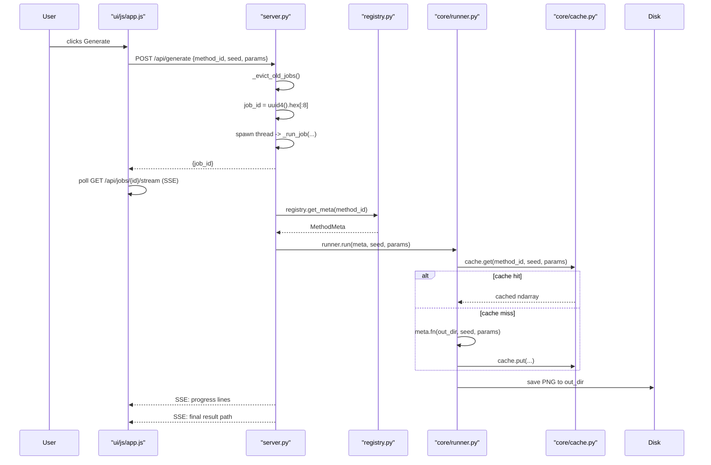
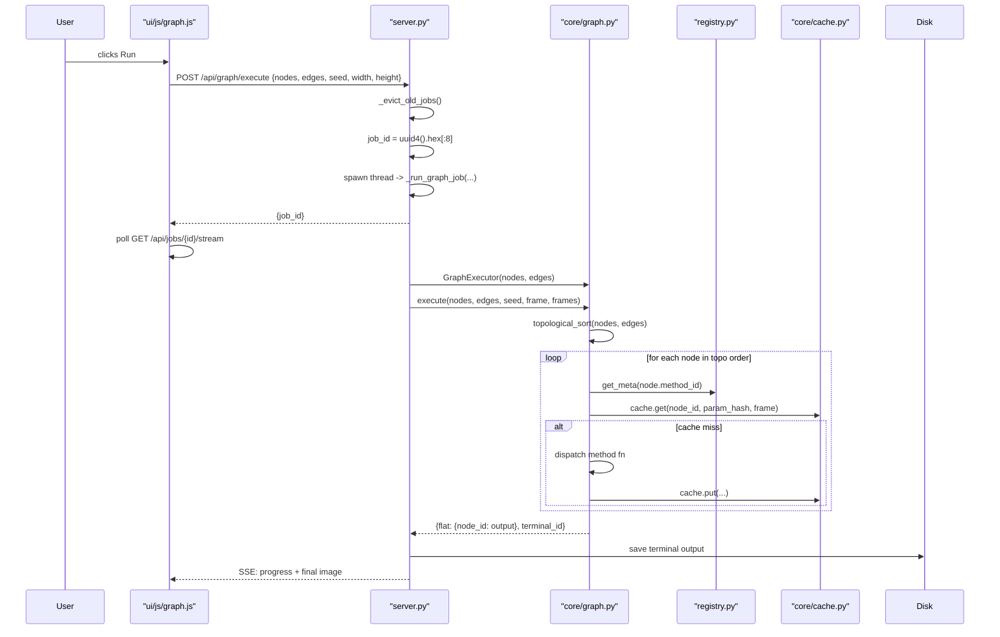
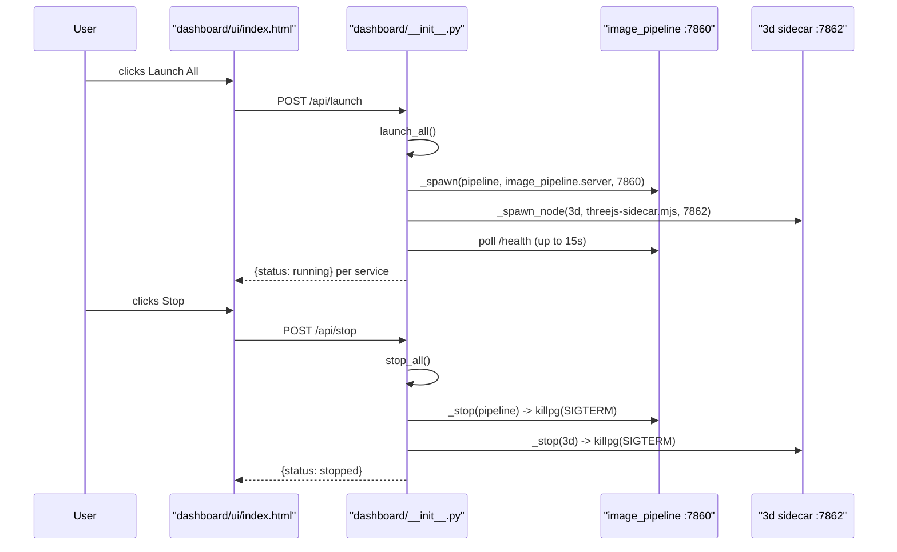

# Sequence Diagrams

Four key workflows, each traced through the real source. Participant names correspond to actual components in the code.

## Workflow: Single Method Generate

Triggered when the user selects a method in the Methods tab and clicks Generate.



### Walkthrough
1. **POST /api/generate** — `server.py:659` creates a job dict with a `queue.Queue`, spawns a daemon thread running `_run_job`, and returns `{job_id}`.
2. **SSE stream** — `server.py:851` (`/api/jobs/{job_id}/stream`) drains the job's queue as Server-Sent Events.
3. **Method lookup** — `_run_job` calls `registry.get_meta(method_id)`; if `None`, pushes an error event.
4. **Run + cache** — the runner checks the LRU cache by `(method_id, seed, params)` hash; on miss it calls `meta.fn(out_dir, seed, params)` and stores the result.
5. **Output** — the method writes its PNG to the job's `out_dir`; the result path is pushed back through the SSE stream.

## Workflow: Node Graph Execution

Triggered when the user clicks Run in the Node Graph tab.



### Walkthrough
1. **POST /api/graph/execute** — `server.py:1516` creates a graph job, spawns `_run_graph_job` in a thread, returns `{job_id}`.
2. **GraphExecutor** — `_run_graph_job` builds a `GraphExecutor` from the node/edge lists and calls `execute()`, which topologically sorts the graph.
3. **Per-node dispatch** — for each node in topo order, the executor looks up `MethodMeta`, checks the frame cache by `(node_id, param_hash, frame)`, and on miss dispatches the method function.
4. **Output** — the executor returns a `flat` dict mapping node-id to output; the terminal node's image is saved and streamed back via SSE.

## Workflow: Live Simulation (Hot-Swap)

Triggered when the user clicks the Live button or edits the graph while a live sim is running.

```mermaid
sequenceDiagram
    participant User
    participant UI as "ui/js/graph.js"
    participant Server as "server.py"
    participant Store as "Shared Graph Doc"
    participant Loop as "_live_loop thread"
    participant Executor as "GraphExecutor"
    participant Cache as "core/cache.py"
    participant MJPEG as "/api/graph/live/stream"

    User->>UI: clicks Live
    UI->>Server: POST /api/graph/live {nodes, edges, frames, width, height}
    Server->>Server: _ensure_executor(...)
    alt no loop running
        Server->>Loop: start _live_loop thread
        Server-->>UI: {status: running}
    else loop running (hot-swap)
        Server-->>UI: {status: running, hot_swap: true}
    end
    loop every frame
        Loop->>Store: read shared graph doc
        Store-->>Loop: {nodes, edges}
        Loop->>Executor: selective_invalidate(old, new, seed)
        Executor->>Cache: flush changed nodes only
        Loop->>Executor: execute(nodes, edges, seed, frame, 1)
        Loop->>MJPEG: push JPEG frame
    end
    User->>UI: edits graph
    UI->>Store: (shared doc updated via /api/graph/save or clear)
    Note over Loop: next frame reads updated doc
```

### Walkthrough
1. **POST /api/graph/live** — `server.py:1660` either starts a new `_live_loop` thread or returns `{hot_swap: true}` if one is already running.
2. **Executor reuse** — `_ensure_executor()` keeps the same `GraphExecutor` across hot-swaps so Architecture-A sim caches survive.
3. **Per-frame doc read** — the loop reads the shared graph document every frame; a cleared doc (empty nodes) stops the render.
4. **Selective invalidation** — `selective_invalidate()` compares old/new node+edge sets and only flushes cache entries for nodes whose non-volatile params changed.
5. **MJPEG stream** — each cooked frame is pushed to `/api/graph/live/stream` as a JPEG for the UI preview.

## Workflow: Dashboard Service Lifecycle

Triggered when the user clicks Launch in the Dashboard UI.



### Walkthrough
1. **POST /api/launch** — `dashboard/__init__.py:256` calls `launch_all()`, which spawns all three services first, then waits for readiness (avoids stacking readiness timeouts).
2. **Spawn** — `_spawn()` launches `python -m <module> --port <port>` under the repo venv with `PYTHONPATH` set to the repo root, in a new session so it survives the parent.
3. **Health check** — `_is_healthy()` requires a 200 from `/health`, not just a LISTEN socket — a wedged server keeps its socket open but answers nothing.
4. **Stop** — `_stop()` kills the whole process group (`os.killpg`) so children die too; `api_stop_one` also calls `_reclaim_port()` to clear orphaned listeners.

